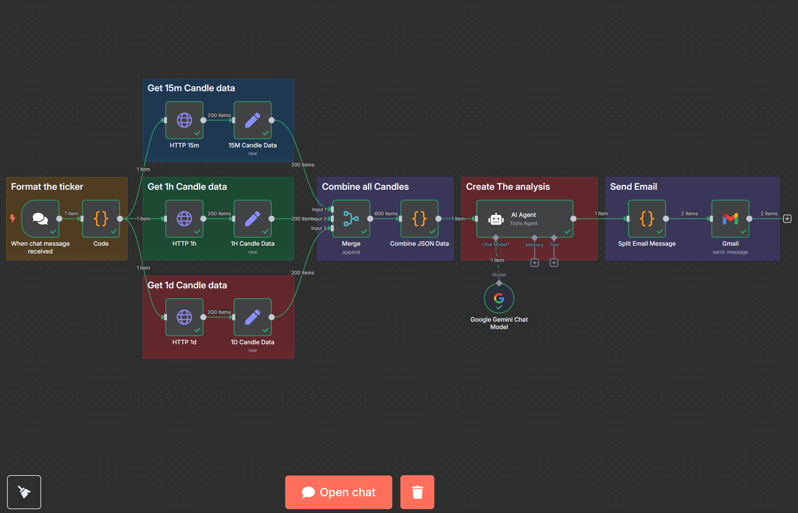

# AI-Enhanced Cryptocurrency Market Analysis with n8n and Google Gemini

This project is an automated workflow for generating actionable cryptocurrency market analysis using real-time data, artificial intelligence, and low-code automation. It was developed as part of an academic project.

---

## 📌 Project Summary

This workflow takes a user-provided crypto ticker (e.g., BTC, ETH) via chat input and performs the following:

* Fetches historical candlestick data (15m, 1h, 1d intervals) from Binance API
* Processes and structures the data using JavaScript code nodes
* Uses Google Gemini (via API) to generate trading analysis and recommendations
* Splits long AI-generated content
* Sends the final output to a user-defined email address

---

## ⚙️ Tools & Technologies

| Tool           | Purpose                        |
| -------------- | ------------------------------ |
| n8n            | Workflow orchestration         |
| Binance API    | Real-time candlestick data     |
| Google Gemini  | AI-powered market analysis     |
| Gmail (OAuth2) | Email delivery of the analysis |

---

## 📁 Project Structure

```
📦 project-root/
├── PFAI_Theory_Project.json   # n8n workflow export file
├── README.md                  # This documentation
```

---

## 🚀 How It Works

1. A user sends a crypto ticker via chat interface.
2. Workflow converts the input to a Binance-compatible trading pair (e.g., BTC → BTCUSDT).
3. Candle data is fetched for 15-minute, 1-hour, and 1-day intervals.
4. Data is structured and combined using JavaScript and merge nodes.
5. AI agent (Google Gemini) generates a prompt-based analysis.
6. Final analysis is split and emailed to the recipient.

---

## 🧠 Use Cases

* Real-time crypto trading insights
* Retail investor education tools
* Financial literacy platforms
* Research simulation in AI/Finance courses

---

## 📦 How to Deploy

1. Clone this repo or download the `PFAI_Theory_Project.json` file.
2. Import the JSON into your n8n instance.
3. Set up API credentials:

   * Binance (Public access)
   * Google Gemini API Key
   * Gmail (OAuth2) account
4. Trigger the workflow by sending a crypto ticker input.
5. Review email for full AI-powered market report.

---

## 🧾 License

This project is for academic and educational use. Please cite or reference the author when using parts of this system.

---

## Workflow Visualization



---

Feel free to fork, adapt, or build upon this project. Contributions welcome!

---
